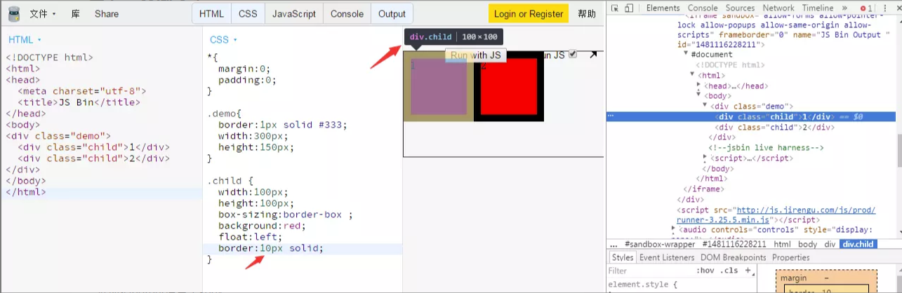
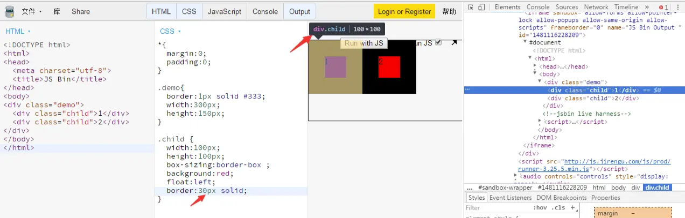
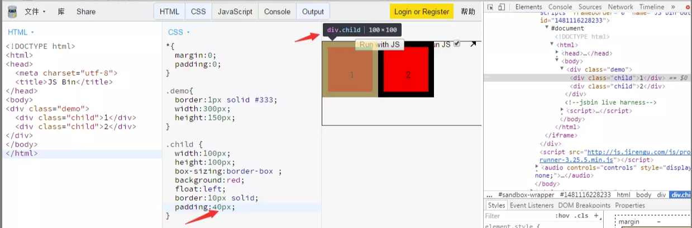

#CSS盒模型（框模型）


###概念
>>CSS框模型描述的是针对文档树的元素而生成,并根据可视化格式模型进行布局的矩形框。每个框都有一个内容区域，还有周围补白、边框和边距区域。

***注意：图片、表单元素一律看做文本。并不是盒子。***


>>每一个节点都会生成0...n个这样的框，但是注意盒子真正的大小为<font color=red>content+padding+boreder</font>，而margin仅仅为了占位

盒模型有两种：W3C标准盒模型和IE盒模型:
1.W3C标准盒模型
&emsp;width与height仅仅代指content的宽高

2.IE怪异盒模型
&emsp;width与height代指content+padding+border的宽高

为了解决这个问题引入了box-sizing 的CSS属性
box-sizing默认为content-box
但当其更改为box-sizing:border-box，则会采用IE盒子模型，此时看以下例子

**设置border为10px

**此时把border改为30px

**加上padding


发现无论怎么修改padding与border都不会对盒子的大小产生影响

##注意
1.body也有margin，文档中最大的盒子为document,body为document的孩子，浏览器默认给body设置margin大小为8px
2.padding区域也有颜色，background-color设置border以内包括padding的所有区域
3.有些元素默认有padding，如ul默认带有40px的padding-left,如果要消除所有的默认的padding，则采用
```
*{
 margin:0;
 padding:0
}
```

4.谨记：盒子中所有顺序都为上右下左，当只有上右或者只有两者之一，对应的下与左与其相同
下面有一个用css画三角形的例子：
```
{
    width:0px;
    height:0px;
    border:30px solid white;
    border-bottom:none;/*将下部清空*/
    border-top-color:red;
}
```