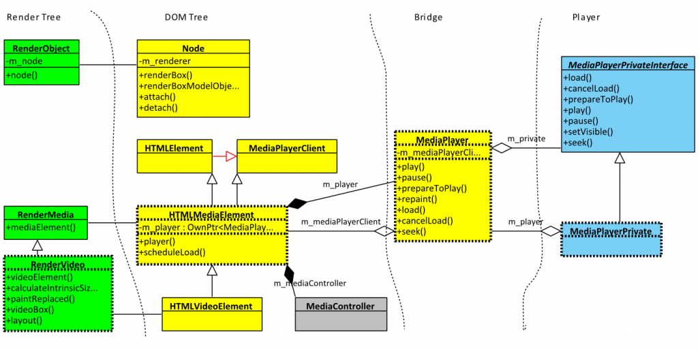
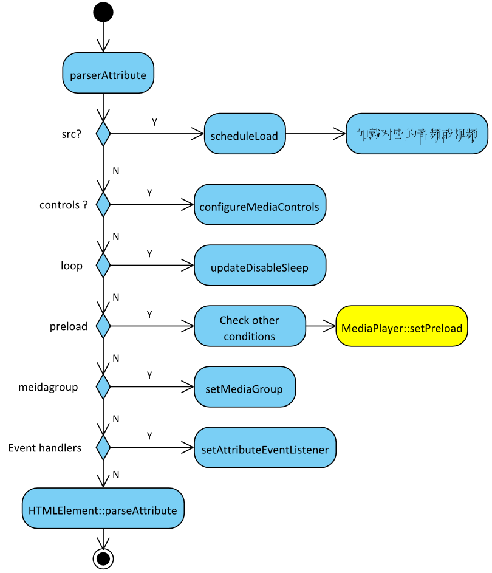

## HTML5
>> 广义论及HTML5时，实际指的是包括HTML、CSS和JavaScript在内的一套技术组合。它希望能够减少网页浏览器对于需要插件的丰富性网络应用服务（Plug-in-Based Rich Internet Application，RIA），例如：Adobe Flash、Microsoft Silverlight与Oracle JavaFX的需求，并且提供更多能有效加强网络应用的标准集。
HTML5添加了许多新的语法特征，其中包括\<video>、\<audio>和\<canvas>元素，同时集成了SVG内容。这些元素是为了更容易的在网页中添加和处理多媒体和图片内容而添加的。其它新的元素如\<section>、\<article>、\<header>和\<nav>则是为了丰富文档的数据内容。新的属性的添加也是为了同样的目的。同时也有一些属性和元素被移除掉了。一些元素，像\<a>、\<cite>和\<menu>被修改，重新定义或标准化了。同时APIs和DOM已经成为HTML5中的基础部分了。HTML5还定义了处理非法文档的具体细节，使得所有浏览器和客户端程序能够一致地处理语法错误。

**&emsp;&emsp;以上是维基百科对html5的解释，由上解释，我们得知html5不仅仅是对以前版本的一些扩展与改进，它更多地是对当前互联网新技术的组合。**
**&emsp;&emsp;下面我们主要针对video，audio，section等网页框架标签进行详细解释，至于svg，canvas以及网络数据库在另外的博客进行讲解。**

#### video
&emsp;&emsp;video元素用于在html或者xhtml中插入媒体播放器，用于支持文档内的视频播放
1.使用
```javascript
<video controls>
  <source src="myVideo.mp4" type="video/mp4">
  <source src="myVideo.webm" type="video/webm">
  <p>Your browser doesn't support HTML5 video. Here is
     a <a href="myVideo.mp4">link to the video</a> instead.</p>
</video>
```
以上是video标签的降级处理，若不设置control属性，视频则不会展示浏览器自带的空间，另外可以通过\<track>元素实现弹幕和标题
2.实现

以上是Webkit中video类的层次结构
htmlMediaElement代表了DOM节点，video、audio的解析都是由它创建开始的，js的domAPI也是以他为对象的。
如果要相对播放器进行扩展，则需要从mediaPlayerPrivate着手，mediaPlayer只是一个桥梁
rendermedia与rendervideo节点主要负责绘制的相关工作，如位置、大小等

当创建一个htmlMeidaElement原件后，解析节点属性时会使用parseAttribute方法。
具体理论不再详述，如想进一步了解，则看参考中的html5的video实现分析。
#### audio
&emsp;&emsp;audio标签也是用来减少对flash插件的使用，它的作用主要是在文档中插入音频文件，属性与video大致相同，下面是使用的例子：
```javascript
<audio controls>
  <source src="horse.ogg" type="audio/ogg">
  <source src="horse.mp3" type="audio/mpeg">
Your browser does not support the audio element.
</audio>
```
#### datalist
&emsp;&emsp;这个标签就很人性了，表面看起来他和select很相似，以下是它们两个的示例：
```html
<input list="brower">
<datalist id="brower">
    <option value="IE">
    <option value="Google">
    <option value="baidu">
</datalist>
```
```html
<select>
    <option vlaue="IE">IE</option>
    <option vlaue="Google">Google</option>
    <option vlaue="baidu">baidu</option>
</select>
```
从上面可以看出他们的区别是:
+ datalist必须配合input使用，并用list和id绑定
+ datalist中的option可以自闭和，而select中option必须成对出现，待选值加载标签对中
+ select可以使用selected指定默认选中，但datalist不行
从上看来，datalist似乎并无优势，反而是缺点，但是它真正的用处是：
&emsp;&emsp;datalist可以看做输入框和下拉框的结合体，可以在框内输入字符（输入时下拉框具有联想筛选功能，也可以直接从下拉框中选择预选选项，而无需自己写脚本去用正则匹配！
#### HTML5 Semantic Elements(语义元素)
HTML5提供新的语义元素来定义网页不同部分：

+ header为头部栏（如logo、标题）
+ nav导航(各个部分的链接)，如网页头部包含的首页、工具等链接
+ serction文档中的节(章节、页眉、页脚等)，常用来划分文章的章节
+ article(独立的一篇文章)
+ aside侧边栏(如相关信息、广告)
+ footer底部栏(如作者信息、联系信息)

**1.何为语义化**
&emsp;&emsp;所谓语义化，就是根据内容的结构选择合适的标签，便于开发者阅读和写出优雅的代码的同时，便于浏览器的爬虫和机器很好的解析。虽然div+id也能达到类似的作用，但是机器并不能理解，机器只能认为这是没有特殊含义的块级元素。

***参考:***
[html5 video MDN](https://developer.mozilla.org/zh-CN/docs/Web/HTML/Element/video)
[Webkit中HTML5 Video的实现分析](https://blog.csdn.net/HorkyChen/article/details/7855814)
[HTML5 Semantic Elements](https://www.w3schools.com/html/html5_semantic_elements.asp)
[HTML语义化 & 网页布局](https://zhuanlan.zhihu.com/p/32990471)