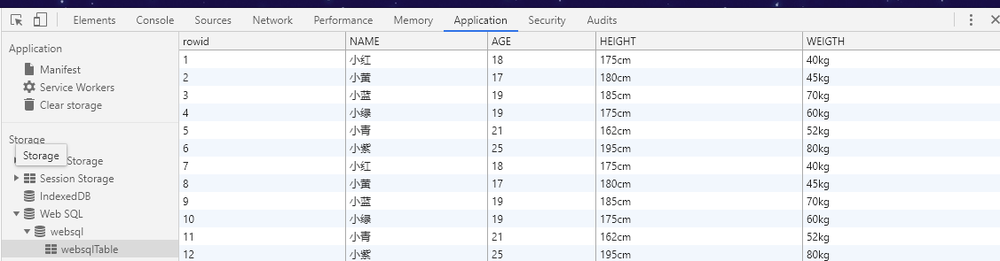

## Web SQL
首先先上一张运行截图：

&emsp;&emsp;以上是在谷歌中执行脚本在websql中创建数据库、插入数据的结果。
&emsp;&emsp;这个结果将一直保存，即使关掉网页重新打开，打开数据库后仍能得到以前操作的结果，但是当你清理浏览器缓存之后，这个结果就不在了，所以我认为其实webSQL就是讲cookie组织为数据库的结果！！！
&emsp;&emsp;下面是运行的源码  
+ [html](./webDataBase.html)
+ [javascript](./websql.js)

#### Web SQL 与 cookie
>>&emsp;&emsp;对于web应用的存储，相信大家都接触过Cookie。Cookie用于弥补HTTP协议的无状态性，服务器可以使用Cookie中包含的信息来判断HTTP传输的状态。但Cookie有自己固有的缺陷，它的大小受限制，大多数浏览器对它的大小限制为4K，且可以被禁用，Cookie在客户端和服务器中来回传输，很浪费带宽；它采用明文处理，存在安全风险，加密和解密则会影响程序性能。

>>&emsp;&emsp; 对于 HTML5，也许很有用的就是它新推出的“Web Storage”（Web 存储）API，它包括 localStorage 和 sessionStorage，对简单的键值对（比如应用程序设置）或简单对象（如应用程序状态）进行存储，使用本地和会话存储能够很好地完成，对于存储少量的数据非常有用，但是对大量的结构化数据进行处理时，它就力所不及了，而这正是 HTML5 的“Web SQL Database” API 接口的应用所在。

***参考***
[HTML5 Web SQL Database 简介](https://www.ibm.com/developerworks/cn/web/1108_zhaifeng_websqldb/index.html)
