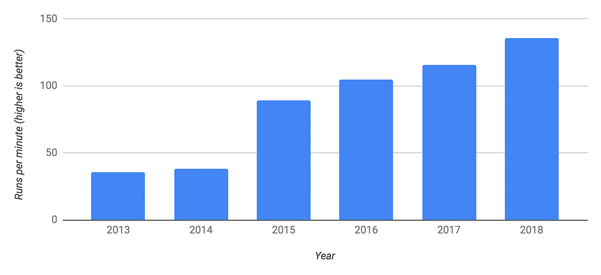

# V8引擎
2020-01-06 21:22:15 +0800
categories: dotnet
---

V8引擎是现在最流行的浏览器引擎，占据60%市场的Chrome是它的忠实用户，node.js与Electron分别用它打开了服务端与桌面端的市场，它也打破了js性能很难提高的断言(因为javascript是解释性语言，它不同于编译性语言，他需要一边编译一边执行，V8是即时编译器，即JIT编译器)，它的性能在逐年稳步提高。

---

#### 浏览器不仅仅只是处理表单
浏览器在刚开始很长一段事件，主要的业务逻辑就是处理表单，但是随着发展，它的功能越来越丰富，包括网络，资源管理，开发者工具，webgl等等，这些都需要快速的解析和执行javascript脚本

---

#### V8引擎的内部结构
V8引擎由很多模块组成，大概有100万行C++代码，但是其中4个模块是最重要的：
>+ Parser:负责将Javascript转化为Abstract Syntax Tree(AST)
>+ Ignition:解释器，负责将AST转化为ByteCode，解释执行ByteCode；同时收集TurboFan优化编译的信息，比如函数参数的信息
>+ TurboFan:编译器，利用Ignitio收集到的类型信息，将ByteCode转换为优化后的汇编代码;
>+ Orinoco:垃圾回收模块，负责将程序不再需要的内存空间回收
>流程图如下：

这看起来好像并没有有什么优化阶段，别急，下面绝对让你惊艳，众所周知，javascript是面向函数编程。
+ 若函数没有被调用，则V8不会去编译ta
+ 若函数纸杯调用一次，转化为ByteCode就被解释执行了，无需优化编译，因为TurboFan需要Ignition收集函数执行时的类型信息，从而根据不同的类型来执行优化编译(**动态类型语言的硬伤**),这就要求函数至少执行一次
+ 如果函数执行多次，则它会变为热点函数，Ignition会收集类型信息，证明可以进行优化编译，这时TurboFan会将ByteCode编译为机器代码，以提高执行的性能
+ 但是会存在将机器代码转化为ByteCode的情况，这就要怪javascript是动态语言，比如TurboFan在进行优化时，会根据收集到的类型信息，会将参数认为是一种类型，如整数(浮点数也要区分),进行转化为机器码，不会根据不同的类型，重复编码，**但是如果参数变成了其他类型,则需要将其转化为ByteCode**

***注意***
1.ByteCode在某种程度上就是汇编语言，只是它没针对特定的CPU，它针对的是虚拟的CPU，这样的话生成的ByteCode会简单很多，这样可以简化V8的编译过程
2.当汇编语言再转化为ByteCode，解释执行之后，下次调用会再次利用TurboFan转化为汇编语言，循环往复，所以为了性能，尽量不要去改变变量的类型，这也体现出TypeScript的优势

---
**参考资料**