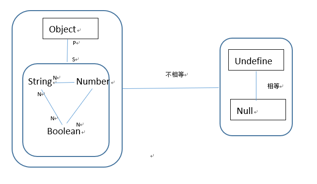

## Javascript中的数据类型
#### 一.分类
1.基本数据类型：
&emsp;&emsp;&emsp;String、Number、Boolean、Symbol、Null、Undefined
2.引用数据类型：
&emsp;&emsp;&emsp;Object（包括Function,Date等）

#### 二.特殊的Symbol
&emsp;&emsp;Symbol最大的特点就是独一无二。这个独一无二指的是即使两个Symbol外表完全相同，它也是独一无二的，永远不可能相等。
它的使用方法是：
&emsp;&emsp;var mySymbol=Symbol([desprication]);
注意：
+ 不能使用new运算符，所以Symbol是普通值类型。
+ desprication仅仅是为了标识，方便调试，别无它用，即使描述完全享用，两个symbol值也不相同。
+ desprication可以是除了symbol的任意类型的值，因为它们都可以转化为string

#### 三.判别
如何判断变量是基本数据类型还是引用数据类型
1.typeof
&emsp;&emsp;&emsp;typeof 作为运算法，使用方法为typeof a;(a为变量),它能够区分基本数据类型，判断出变量是string，number，unfeined还是boolean等，但是typeof对于引用数据类型的区分却不明确，它只能区分object与function，其余的Date，Array等会被识别为Object，另外Null也会被识别为Object
2.instanceof
&emsp;&emsp;&emsp;instanceof的出现可能就是为了解决上面问题，instanceof作为运算符，它的使用方法为 obj instanceof Array（obj为变量），它能够很好的识别变量是哪一种引用类型，包括自定义引用类型
另外它的重点是能够判断构造函数的原型是否位于指定对象的原型链中。因此要真正理解instanceof，首先要理解原型链。
&emsp;&emsp;&emsp;[原型链的解析请看另外一篇文档](./原型链.md)
```javascript
// 判断 foo 是否是 Foo 类的实例 , 并且是否是其父类型的实例
function Aoo(){} 
function Foo(){} 
Foo.prototype = new Aoo();//JavaScript 原型继承
 
var foo = new Foo(); 
console.log(foo instanceof Foo)//true 
console.log(foo instanceof Aoo)//true
```
3.isPrototypeOf
&emsp;&emsp;&emsp;isPrototypeOf是用来测试一个对象是否在另一个对象的原型链上，它的使用方法是：obj1.isPrototypeOf(obj2);它与instanceOf的不同是它是判别调用对象是否存在于指定对象的原型链中。

```javascript
var o={};
function Person(){};
var p1 =new Person();//继承自原来的原型，但是现在已经无法访问
Person.prototype=o;
var p2 =new Person();//继承自o
console.log(o.isPrototypeOf(p1));//false o是不是p1的原型
console.log(o.isPrototypeof(p2));//true  o是不是p2的原型

console.log(Object.prototype.isPrototypeOf(p1));//true
console.log(Object.prototype.isPrototypeOf(p2));//true
```

#### 四.类型转换

##### &emsp;&emsp;<font color=red>显式强制类型转换</font>


1.toString();
&emsp;&emsp;该函数负责将非字符串类型转换为字符串类型，常见的number转换按照通用规则进行转换，**但是极大和极小的数字会自动采用指数类型**。其余如null转化为"null",undefined转化为"undefined",true转化为"true",Object如果没有自己改写toString，则会返回内部[ [Class]]的值
，即[Object Object]
2.toNumber();
&emsp;&emsp;true转化为1，false为0，**undefined转化为 NaN，null转化为0**，字符串的处理则基本按照数字常量的相关规则（但若字符串中含有非数字类型字符则转化为NaN）**对象会先使用toPrimitive转化为相应的基本类型值，如果返回的不是数字类型，则再转化为数字**
```javascript
- -"3.14";//结果为3.14
```
3.toPrimitive();
&emsp;&emsp;该函数用来将对象转化为基本数据类型，首先查看valueOf()是否返回基本数据类型，如果是则调用该方法，否则调用toString()，如果该函数也不返回基本数据类型，则返回TypeError
>>从ES5开始，使用Object.create(null)创建的对象原型属性为null，并且没有valueOf()和toString()方法，因此无法进行强制类型转换。

4.toBoolean()
&emsp;&emsp;将非布尔值转化为布尔值
假值对象转化为false:
+ undefined
+ +0和-0
+ null
+ ""
+ false
+ NaN
**注意：假值对象new Boolean(false)仍为true，所有的对象都为真值**

**显式转换方式一般采用Number(),Boolean()等构造函数、parseInt和+，--，!!等操作**

##### &emsp;&emsp;<font color=red>隐式类型转换</font>
1.字符串和数字之间的隐式类型转换
&emsp;&emsp;当加号两边是字符串时（或转化为字符串）则执行字符串拼接操作，否则使用数字相加操作。

```javascript
var a = [1,2]
var b = [3,4]
a + b   //"1,23,4"
```

2.布尔值和数字之间的隐式转换
&emsp;&emsp;true转化为1，false转化为0，则可通过布尔值的相加操作的结果确定有且仅有n个值为true

3.隐式转化为布尔值
&emsp;&emsp;转化为布尔值的情况比较多：
+ if()
+ for(;;)中判断语句
+ ? : 中的判断语句
+ while和do...while()中的判断语句
+ &&和||左边的操作数

##### &emsp;&emsp;<font color=red>宽松等于\==与严格等于===</font>

【1】\===
\=\==与\==最大的区别是前者不进行类型转换。
【2】==
==两边的操作数若类型不同，会发生类型转换，转换的方法如下图所示：

上图所示：N表示临近一方要做toNumber()。P代表着Object要转化为基本数据类型，即valueOf()与toString()
***参考:***
[JavaScript instanceof 运算符深入剖析](https://www.ibm.com/developerworks/cn/web/1306_jiangjj_jsinstanceof/index.html)
[JavaScript中的强制类型转换](https://juejin.im/post/5b3b76de5188251afc25567f)
[Symbol介绍：独一无二的值](https://juejin.im/post/5cdcd7a7e51d453af7192b9a)