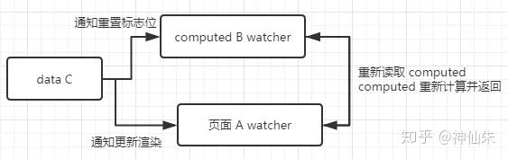

# computed
<font color=gray size=2>2019-12-07 09:40:39 +0800</font>
<font color=gray size=2>categories: dotnet</font>
---

为何会出现计算属性，是因为我们有时候要对data中的属性进行一些额外的操作，如果仅仅是一些简单的操作，我们可以放在模板内的表达式中，但是如果是一些比较复杂的操作该怎么办呢？这个时候就出现了计算属性。

---

#### 问题
1. computed是响应式的吗？
2. 如果也是响应式，那它每一次都要运算吗？
3. 它是独立的一个属性吗？

#### 关键知识点
+ 脏数据标识位 dirty

---
#### 示例
```javascript
<div id="app">
    <pCom :txt="parentText">{{txt:reversedText}}</pCom>
</div>

var app=new Vue({
    el:"#app",
    data:{
        parentText:"I am is parent"
    },
    components:{
        pCom:{
            props:{
                txt:""
            },
            template:"<p>父组件传入的值{{txt}}</p>",
        }
    },
    computed:{
        reversedText:function(){
            return this.parentText.split("").reverse().join("");
        }
    }
})
```


#### 回答
1. computed是响应式的，它同样存在get，set函数，也存在依赖收集
2. 并不是每一次都要运算，这就要涉及到脏数据位，computed会维护一个脏数据位watcher.dirty，初始状态为true,但这个时候并未进行计算，只有当页面元素pCom使用计算属性时，因为脏数据位为true，所以会进行计算，计算结束后会将脏数据位设置为false，计算属性会将计算的结果保存到reversedText这个属性上，当脏数据位为false时，会直接读取这个属性的值，不会再进行计算，这就是**计算缓存**。
3. 它并不是一个独立的属性。它依赖于data中的属性，当data中属性发生改变，会通过保存的依赖收集告诉computed属性他发生了改变，这是computed属性中的脏数据位被重置为true，而且data中保存的不仅仅是computed属性的依赖，读computed数据的页面元素也会保存到data的依赖中，当data改变时，会通知页面元素读computed属性，computed因脏数据位为true，重新计算返回给元素，而不是computed属性主动告知页面元素。

整体的流程为：



**参考资料**

#### 何时要用计算属性
&emsp;&emsp;使用计算属性还是methods取决于你是否需要缓存，当遍历大数组和做大计算时，应当使用计算属性。